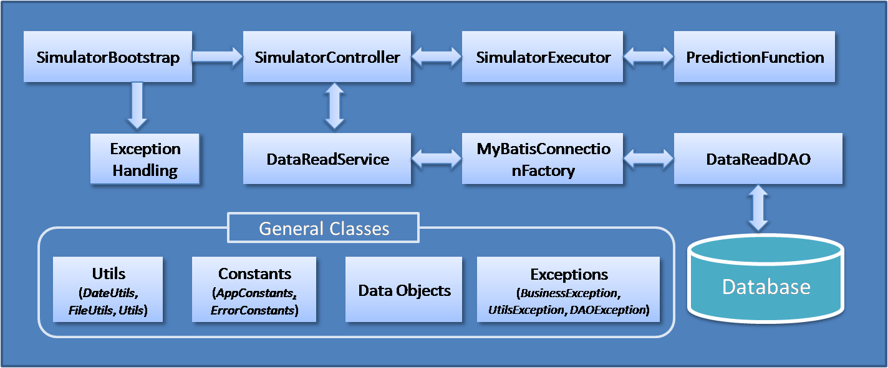

# Environment Simulator

&nbsp;&nbsp;&nbsp;&nbsp;&nbsp;		Environment Simulation program predicts environment details such as weather conditions for different locations based on historical data.

## Functional Description
&nbsp;&nbsp;&nbsp;&nbsp;&nbsp;		When the program is triggered, historical data available from previous years is fetched as reference data and forecast the environment conditions for future days of the year. Prediction of weather parameters (temperature, pressure & relative humidity) are performed by using [ARIMA Model](https://github.com/Workday/timeseries-forecast), which provides a time series forecasting functionality. Then Weather condition (Rainy, Fog, Hot etc.) is predicted based on the forecasted weather parameters. </br>
&nbsp;&nbsp;&nbsp;&nbsp;&nbsp;		Result of the program will be a list of environment conditions for different locations and different dates, which will be written to an output file. Each lines of the result include name of the location, its position (combination of its latitude, longitude & elevation), prediction time (expressed in UTC timezone), weather condition, temperature(°C), pressure(hPa) and relative humidity(%).

Forecasted environment details will be like : 

```Sydney|-33.52,151.13,58|2017-08-30 10:23:27|Warm|16.8|53.2|1016```

which can be read in the following order :
 
```location|latitude,longitude,elevation|date_time|conditions|temperature|pressure|humidity```


## Technical Description

### Process Flow


1. **SimulatorBootstrap.java** - The process flow starts here. This class ensure correctness of user inputs, load external property file, process input arguments and starts the execution. 
2. **SimulatorController.java** - This class controls the flow of the program. Based on the user input, required historical data is fetched from database and triggers the next execution stage.
3. **SimulatorExecutor.java** - Historical environment data fetched from database is processed based on day of year and location to feed the prediction model. Prepare the output content from the predicted result received from model and write it to output file.
4. **PredictionFunction.java** - Predicts the future weather parameters using ARIMA model. Also identify weather type from the predicted parameters.
5. **DataReadService.java**, **MyBatisConnectionFactory.java**, **DataReadDAO.java** - These classes are used for fetching historical data from database using myBatis framework with the help of myBatis Configuration file and myBatis mapper file.


## Project setup

### Database

Data related to location and weather details are stored in 'LOCATION' and 'WEATHER_DETAILS' table respectively.</br>
LOCATION table store data like location name, latitude, longitude, elevation etc.
WEATHER_DETAILS table store data like date, temperature, pressure, humidity, condition etc.

- Execute the scripts [table_create_scripts.sql](/environment-simulator/src/main/resources/log4j.properties) to create database and tables in mysql database.</br>
- Execute all insert scripts in the path ["/src/main/resources/database"](/environment-simulator/src/main/resources/database) to load historical data for default locations to database.</br>

	NOTE : Following excel [create_historical_data.xlsx](/environment-simulator/src/main/resources/database/create_historical_data.xlsx) will help to create insert
	scripts of historical data.

	Default Locations : Sydney, Melbourne, Adelaide.
	
- For adding new location download historical data and insert it to database.

### Program

###### Prerequisites

- JDK 1.7 or higher (JAVA_HOME and PATH set) for compile and execution
- Apache Maven 3.3 or higher (MVN_HOME and PATH set) for build


###### Build
Go to the project base directory, the directory where pom.xml for environment-simulator is present.

Execute the command to build jar :


The following outputs jar will be generated :  **environment-simulator.jar**


## Program Execution

####  Modes of operation

This module works in 3 modes :

- **default-one week** (no input parameter)	=> Forecast environment details for one week from today.
- **date** (one input date parameter)		=> Forecast environment details for the specific date.
- **date-range** (two input date parameter)	=> Forecast environment details for the dates between queried start and end dates.

#### Input properties

Configurable properties like output file path, database setup etc. are stored in [EnvironmentSimulator.properties](/environment-simulator/src/main/resources/properties/EnvironmentSimulator.properties) file.
Make necessary changes and place the file in the same path as the executable jar.

#### Execution Commands


Note : The date format should be yyyy-MM-dd, for eg: 2017-08-28.

###### Main class

[com.cba.simulator.bootstrap.SimulatorBootstrap.java](environment-simulator/src/main/java/com/cba/simulator/bootstrap/SimulatorBootstrap.java)

###### Dataset Considered

Historical weather data between 2009 and 2016 (both years inclusive) for 3 locations listed below :

- Sydney
- Melbourne
- Adelaide

	Link to source data : [historical data source](https://www.wunderground.com/history/).

#### Forecast Result

After execution of the program, the forecasted weather data will be generated as a text file in the path as in [EnvironmentSimulator.properties](/environment-simulator/src/main/resources/properties/EnvironmentSimulator.properties)

Format of data in the output file : 
- **location|latitude,longitude,elevation|date_time|conditions|temperature|pressure|humidity**

###### Sample output

-  **Sydney|-33.52,151.13,58|2017-08-30 10:23:27|Warm|16.8|53.2|1016**
-  **Melbourne|-37.49,144.58,25|2017-08-30 10:23:27|Rain|11.1|70.4|1018**
-  **Adelaide|-34.56,138.36,59|2017-08-30 10:23:27|Rain|16.7|61.3|1014**

Logs will be generated in a text file named '*log4j-application.log*' in the directory '*/log*' which will be in the same path as the executable jar. Log4j properties can be edited [log4j.properties](environment-simulator/src/main/resources/log4j.properties).


## References
#### TestCases:

JUnit test cases are available in the path ["/src/test/java/com/cba/simulator"](environment-simulator/src/test/java/com/cba/simulator), which would run on build using Maven.

#### Documentation:

Documentations are available in the path ["/doc"](environment-simulator/doc/).

## Author / Contribution

Gills Antony

## Version

1.0 - Initial and complete release version.

## License

This project is licensed under the GNU License. See the [LICENSE](/LICENSE) for details.
